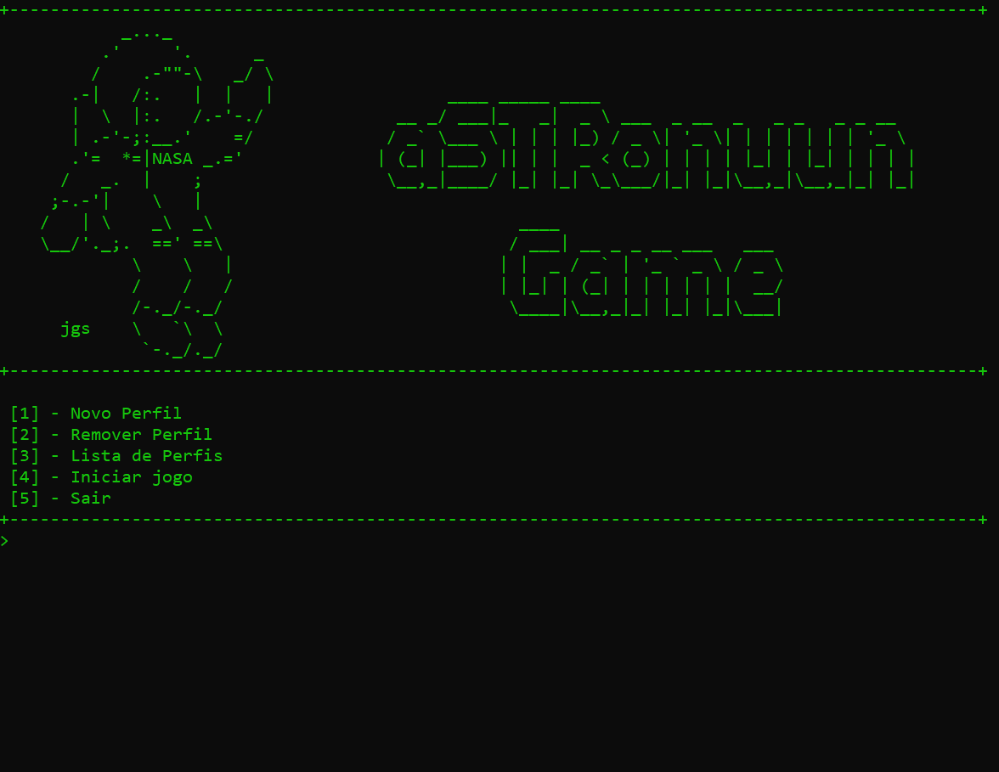
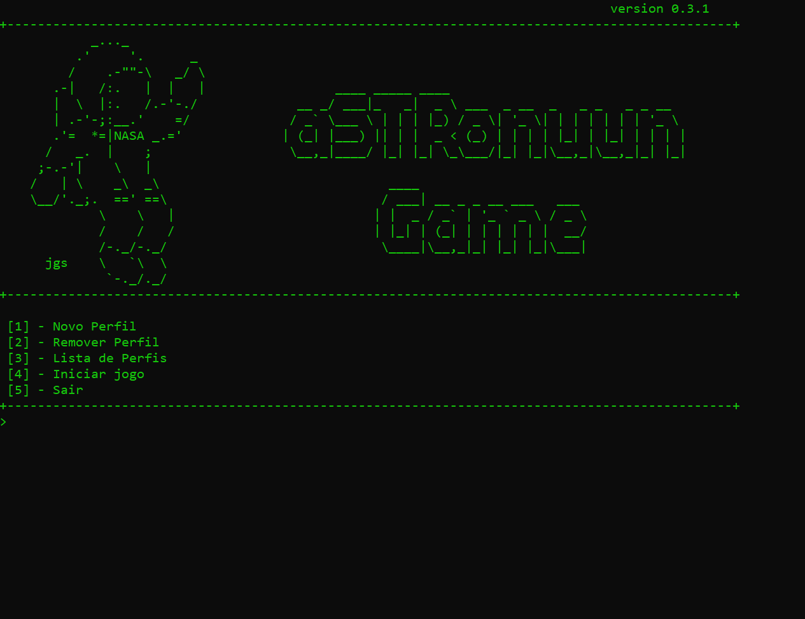

<h1 align="center">
    
</h1>


# Indice
- [Sobre](#-sobre)
- [Previw do Sistema](#-previw-do-sistema)
- [Inserir e Remover Pefis](#-inserir-e-remover-perfis)
- [Novo Jogo](#-novo-jogo)
- [Recursos do Sistema](#-recursos-do-sistema)
- [Tecnologias Utilizadas](#-tecnologias-utilizadas)
- [Como baixar e instalar o projeto](#-como-baixar-e-instalar-o-projeto)


## 📝 Sobre

O projeto **aSTRonuun Game** é um software open source desenvolvido por uma equipe de três alunos, com orientação do Professor **Criston Pereira, Dr. em Ciências da Computação pela PUC-Rio.** O projeto tinha como finalidade, colocar em prática os conhecimentos de programação adiquiridos na disciplina de **Fundamentos de Programação** do curso de Engenharia de Software - UFC, campus Quixadá.

O Software é um **Mini-Game** de perguntas e respostas focada em temas de Física e Astronomia, com objetivo de que os usuários possam aprender mais sobre essas áreas tão fantásticas e que são envoltas de mistérios.

O programa foi projetado para trazer uma nova abordagem de aprendizado, contando com um sistema de **Gamificação**, que a medida que o usuário
responde corretamente os questionamentos, ele pode ganhar XP (Experiência), para conseguir liberar novos conteúdos.


---

# 👀 Previw do Sistema

## Inserir e Remover Perfis
<h1 align="center">
    
</h1>

## Novo Jogo
<h1 align="center">
    
</h1>

## 🔧⚙️ Recursos do Sistema
O sistema conta com algumas funcionalidades extras que dão mais segurança e desempenho.
Algumas de suas características principais:
- Memória **alocada dinamicamente**
- **Persistencia de dados** em arquivos
- Função dividas em bibliotecas locais separadas
- **Compilação separada** de bibliotecas
- **Sistema de Gamificação**

---

## 🚀 Tecnologias utilizadas

O projeto foi desenvolvido utilizando as seguintes tecnologias.

- C
- [C++](http://www.cplusplus.org/)


---


## 💾 Como baixar e instalar o projeto

```bash

    # Clonar o repositório
    git clone https://github.com/aSTRonuun/aSTRonuun-Game

    # Entrar no diretório
    cd aSTRonuun-Game

    #Compilar as bibliotecas
    g++ -c historia.c
    g++ -c profiles.c

    #Gerar o executável
    g++ AstronuuGame.cpp historia.c profiles.c
```
⚠️ OBS - Pré-requisitos para compilação:

Windows
- [MinGW](http://www.mingw.org/)

Linux
- GCC atualizado
```bash
    #Atualizar as listas de pacotes
    $ sudo apt update

    #Instale o pacote de compilação
    $ sudo apt install buid-essentil

    #Confirme a instalação
    $gcc --version
```

---

Desenvolvido 💜 por 
- [Vitor Alves](https://github.com/aSTRonuun) (aSTRonuun)
- Maria Eduarda
- Renan Sampaio
